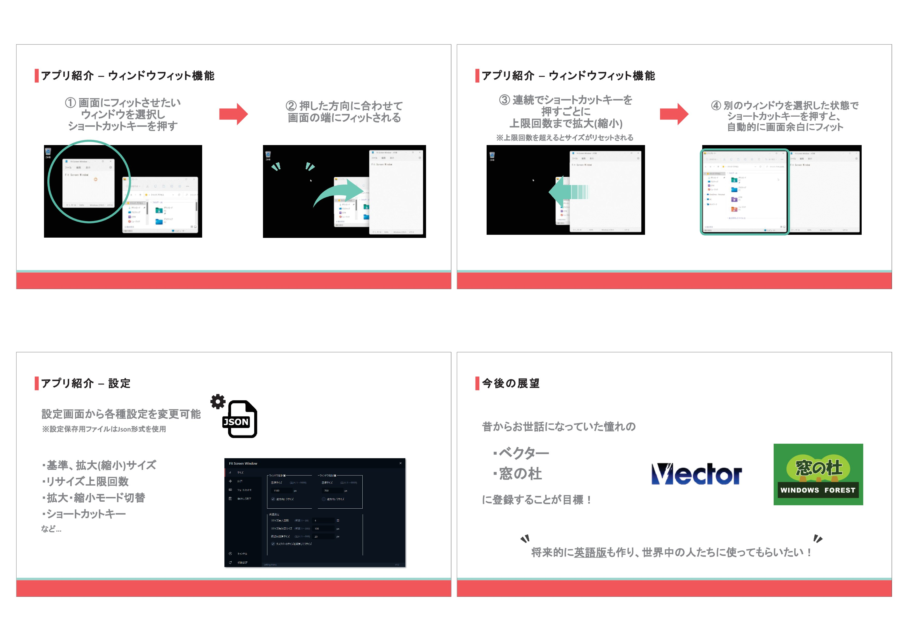

# Fit Screen Window

FitScreenWindowは、Windows用のウィンドウ移動・リサイズツールです。

また、本アプリはPythonで開発されたオープンソースソフトウェアです。

***

## 機能紹介

選択中のアクティブなウィンドウに対して、ショートカットキーを押すごとに、画面の端に合わせて自動的に配置 & サイズを拡大または縮小します。

<b>[初期ショートカットキー(変更可能)]</b>

- 左方向へ配置：<b>Shift + Alt + ←</b>

- 右方向へ配置：<b>Shift + Alt + →</b>

***

また、サイズやショートカットキーなどの各種設定は、タスクトレイからアプリを右クリックし、表示されたメニューの「設定」から変更可能です。

***

## LT資料(2022年5月登壇)

https://www.docswell.com/s/Kawaichi0228/51JE1L-2023-12-03-222909

(LT資料の一部)

***

## 著作権

[MIT License](https://opensource.org/licenses/MIT)

***

## 公式サイト

https://fitscreenwindow.com/
