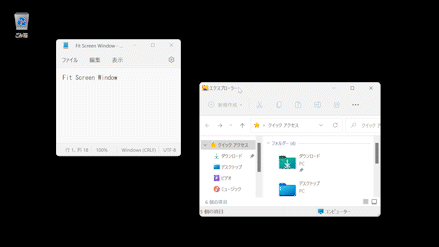
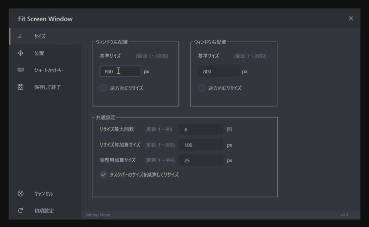

[![License][license]][license-url]
[![Top Language][top-language]][top-language-url]
[![Last Release][last-release]][last-release-url]
[![Last Commit][last-commit]][last-commit-url]

   
  

## FitScreenWindow

A window moving/resizing tool for Windows.

* [Official website (for Japanese Only)](https://fitscreenwindow.com)
* [Technical information (for Japanese Only)](https://kawaichi0228.com/product/fitscreenwindow)

***

### Feature Overview

- Automatically move and resize the active window to the edge of the screen each time you press a shortcut key.

#### [Initial shortcut key (changeable)]
  - Placed towards the left：<b>Shift + Alt + Left</b>
  - Placed towards the right：<b>Shift + Alt + Right</b>

---

- Various settings such as size and shortcut keys can be changed by right-clicking the app from the task tray and selecting "Settings" from the menu that appears.

## Installation

1. Download the latest version from the [official website](https://fitscreenwindow.com) or [GitHub Releases](https://github.com/Kawaichi0228/FitScreenWindow/releases).
2. Unzip the downloaded file, launch the NSIS installer, and follow the guide to install FitScreenWindow.
3. Run "FitScreenWindow.exe".
4. The app will start up and the icon will appear in the task tray.
5. Right-click the icon in the task tray and select "Settings(設定)" to change the settings.
6. To exit the app, right-click the icon in the task tray and select "Exit(終了)".
7. To uninstall the app, launch the uninstaller.

## License

[MIT](https://github.com/Kawaichi0228/FitScreenWindow/blob/master/LICENSE)

[license]: http://img.shields.io/badge/license-mit-blue.svg?style=flat-square
[license-url]: https://raw.githubusercontent.com/Kawaichi0228/FitScreenWindow/master/LICENSE
[top-language]: https://img.shields.io/github/languages/top/Kawaichi0228/FitScreenWindow.svg
[top-language-url]: https://github.com/Kawaichi0228/FitScreenWindow/search?l=python
[last-commit]: https://img.shields.io/github/last-commit/Kawaichi0228/FitScreenWindow.svg
[last-commit-url]: https://github.com/Kawaichi0228/FitScreenWindow/graphs/commit-activity
[last-release]: https://img.shields.io/github/release-date/Kawaichi0228/FitScreenWindow.svg
[last-release-url]: https://github.com/Kawaichi0228/FitScreenWindow/releases
